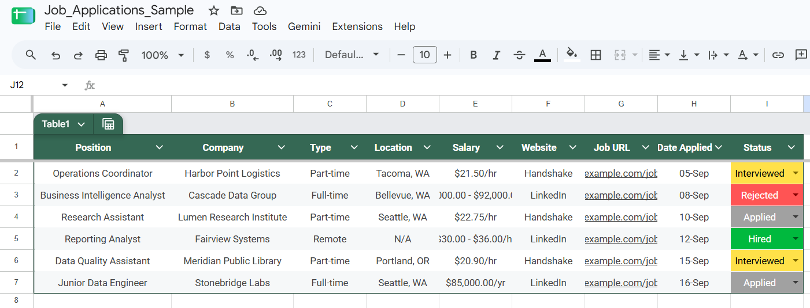

# Job Application Tracker

[](https://colab.research.google.com/github/KarimAguilar/job-application-tracker/blob/main/job_tracker.ipynb)
[](https://mybinder.org/v2/gh/KarimAguilar/job-application-tracker/main?labpath=job_tracker.ipynb)

A Jupyter notebook that turns a copied job posting URL into a clean, normalised row in a Google
Sheet. Copy a link from LinkedIn or Handshake, run one cell, confirm the fields it pulled, and the
row is written into the spreadsheet.

I built it because keeping a job search organised by hand meant retyping the same nine fields for
every application, with the formatting drifting a little each time — `$21.30/hr` in one row,
`21.30 per hour` in the next. The notebook extracts those fields from the posting, normalises them
against a fixed set of rules, and writes one consistent row per application.

---

## What it does

1. Reads a job posting URL from your clipboard (or you paste it at a prompt).
2. Fetches the page and pulls out the fields — from schema.org `JobPosting` structured data where
   the site publishes it, from LinkedIn's public job card otherwise.
3. Normalises what it found: employment type, location, salary with its pay period, and a cleaned
   URL with tracking parameters stripped.
4. Checks whether that URL is already logged, and warns you if it is.
5. Shows you every field for confirmation. Press Enter to accept a value, or type a correction.
6. Writes the row into your Google Sheet.

Nothing is written until you have seen and confirmed every field.

---

## The spreadsheet it writes to

The notebook writes to a nine-column table. My own workbook is named **`Job_Applications`** and the
table inside it is named **`JobApplications`** — **yours can be named anything**, as long as you set
`SHEET_NAME` in the notebook to match your workbook's name in Google Drive.



> **The screenshot above contains sample data only.** Every row is fabricated for illustration —
> the companies, links, pay rates and statuses are invented and none of them represent a real
> application. The same rows are in [`sample_data.csv`](sample_data.csv) if you want to load them
> into a sheet of your own while setting things up.

What matters is that the headers sit in **row 1, in columns A through I, in this exact order**. The
notebook writes to the range `A{row}:I{row}`, so the order is not optional.

| Column | Header | Example value | Notes |
|---|---|---|---|
| A | `Position` | `Data Analyst Intern` | Scraped, then confirmed by you |
| B | `Company` | `Northwind Analytics` | Scraped, then confirmed by you |
| C | `Type` | `Part-time` | One of: Full-time, Part-time, Remote, Internship |
| D | `Location` | `Seattle, WA` | Set to `N/A` automatically when Type is Remote |
| E | `Salary` | `$21.30/hr` | Normalised with its period: `/hr`, `/day`, `/wk`, `/mo`, `/yr` |
| F | `Website` | `LinkedIn` | Either `LinkedIn` or `Handshake` |
| G | `Job URL` | `https://www.linkedin.com/jobs/view/4435327051/` | Tracking parameters stripped; used for duplicate detection |
| H | `Date Applied` | `18-Sep` | Today's date, `%d-%b`, in the configured timezone |
| I | `Status` | `Applied` | Default value, configurable |

**A formatted Google Sheets table is optional.** I use one so new rows inherit the formatting and so
`Status` can be a coloured dropdown. A plain sheet with the same headers in row 1 works exactly the
same way.

If you do use a table and a new row lands *below* it instead of inside it, the table's range has
stopped short: click any cell in the table, drag the handle at the bottom-right down a few rows, and
it will absorb new rows again.

---

## Seeing it work without setting anything up

**You do not need credentials, an install, or a Google account to see the parsing work.**

The notebook in this repository is saved **with its output cells intact**, so opening
[`job_tracker.ipynb`](job_tracker.ipynb) right here on GitHub shows the code alongside the results
it produced. Nothing to run.

**Section 6 is a self-contained demo** that requires no credentials at all. It feeds a fixed block
of messy text through the full normalisation pipeline and prints the finished record:

```
Parsed from the sample block:

  Position      Data Analyst Intern
  Company       Northwind Analytics
  Type          Internship
  Location      Seattle, WA
  Salary        $24.00/hr
  Website       LinkedIn
  Job URL       https://www.linkedin.com/jobs/view/4435327051/
  Date Applied  18-Sep
  Status        Applied
```

The input to that was:

```
Data Analyst Intern
Northwind Analytics
Seattle, WA
$24.00/hr
Internship · On-site
Posted 3 days ago
120 applicants
Apply
```

and the URL `https://www.linkedin.com/jobs/view/4435327051/?refId=abc123&trackingId=xyz789`. Four
things happened in between: the noise lines were dropped, the salary kept its pay period, the type
line was recognised as a type line rather than mistaken for the job title (and `Intern` inside
*Data Analyst Intern* did not trigger a false match), and the tracking parameters were stripped
from the URL.

**To run it yourself in a browser**, use either badge at the top. Colab needs a Google account but
starts instantly; Binder needs no account but takes a minute or two to build the environment from
`requirements.txt`. In both cases, run sections 1 through 6 — they need no credentials. Sections 7
onward write to Google Sheets and do require the setup below.

If an import fails in Colab, run `!pip install -r requirements.txt` in a cell first.

---

## Requirements

Python 3.9 or newer, and Jupyter.

```bash
pip install -r requirements.txt
```

| Package | Used for |
|---|---|
| `gspread`, `google-auth` | Reading and writing the Google Sheet |
| `requests`, `beautifulsoup4` | Fetching and parsing job pages |
| `pytz` | Dating each row in your local timezone |
| `pyperclip` | Reading the URL from your clipboard (optional) |

`pyperclip` is the only optional one. On Linux it needs `xclip` or `xsel` installed; without it the
notebook just asks you to paste the URL instead.

---

## Setup: you need your own Google credentials

**This is the part that will not work until you do it, and it cannot be skipped.**

The notebook authenticates to Google as a **service account** — a robot account with its own email
address and its own private key. **No credentials are included in this repository, and none ever will
be.** You have to create your own. Ten minutes, once.

### 1. Create the service account and download its key

1. Go to the [Google Cloud Console](https://console.cloud.google.com/) and create a project, or
   select an existing one.
2. Go to **APIs & Services → Library** and enable both:
   - **Google Sheets API**
   - **Google Drive API**
3. Go to **APIs & Services → Credentials → Create credentials → Service account**. Give it a name
   and click through to create it.
4. Open the service account you just made, go to the **Keys** tab, and choose
   **Add key → Create new key → JSON**. A `.json` file downloads.
5. Rename that file to **`credentials.json`** and place it in the same folder as the notebook.

### 2. Share your spreadsheet with the service account

This is the step people miss, and it is the reason the notebook throws a permissions error.

A service account is a separate Google user. It cannot see your spreadsheet just because you own it.

1. Open `credentials.json` in a text editor and find the `"client_email"` value. It looks like
   `tracker-bot@my-project-123456.iam.gserviceaccount.com`.
2. Open your spreadsheet in Google Sheets, click **Share**, paste that email address, set it to
   **Editor**, and share.

That's it. The notebook can now read and write that sheet.

> **If the spreadsheet does not exist yet**, the notebook will offer to create one for you and ask
> for your Gmail address so it can share it back with you. Be aware that a sheet created this way is
> owned by the service account and lives in *its* Drive, not yours. Creating the sheet yourself and
> sharing it with the service account is the cleaner path.

### Keep the key private

`credentials.json` is listed in `.gitignore` and will not be committed. Treat it like a password:
anyone holding that file can read and write every Google Sheet the service account has access to.

If you ever commit it by accident, go straight to the Google Cloud Console, delete that key under
the service account's **Keys** tab, and generate a new one. Removing the file in a later commit is
not enough — it stays in the repository's history.

---

## Configuration

At the top of the notebook (section 1):

```python
SHEET_NAME       = "Job_Applications"    # your spreadsheet's name in Google Drive
WORKSHEET        = None                  # None = first tab, or e.g. "Sheet1"
CREDENTIALS_FILE = "credentials.json"
TIMEZONE         = "US/Pacific"
DATE_FORMAT      = "%d-%b"               # 18-Sep
DEFAULT_STATUS   = "Applied"
CHECK_DUPLICATES = True                  # warn if the Job URL is already logged
```

`SHEET_NAME` must match your workbook's filename in Drive **exactly**, including capitalisation and
underscores. Mine is `Job_Applications`; change it to whatever yours is called.

---

## Running it

1. Open `job_tracker.ipynb` in Jupyter.
2. Run sections 1 through 7 once. They only define functions and configuration — nothing is written.
3. Copy a LinkedIn or Handshake job URL to your clipboard.
4. Run the last cell: `add_job()`.

You can also pass a link directly: `add_job("https://www.linkedin.com/jobs/view/4435327051/")`.

A session looks like this:

```
Connecting to Google Sheets...

Detected URL from clipboard: https://www.linkedin.com/jobs/view/4435327051/

Reading the job posting...

--- Review Data Before Sending to Google Sheets ---
Position [Data Analyst Intern]:
Company [Northwind Analytics]:
  1) Full-time   2) Part-time   3) Remote   4) Internship
Type [Internship]: 2
Location (e.g. Seattle, WA) [Seattle, WA]:
Salary (e.g. 25/hr, 1500/mo, 85k-110k/yr) [$21.30/hr]:
Date Applied [18-Sep]:
Status [Applied]:

Success! 'Data Analyst Intern' inserted inside your table at row 23.
```

Press Enter to keep any value shown in brackets, or type a replacement.

---

## Handshake postings need one extra step

Handshake job pages are visible only to signed-in students. A script making an anonymous request
receives the login page instead of the posting, so there is no scraping around it.

When the notebook detects a login wall, it asks you to paste the posting's header block instead:

1. Open the posting in your browser.
2. Select the block containing the title, employer, location, pay and job type.
3. Copy it, paste it at the prompt, then press Enter on an empty line.

The parser reads those five fields in any order, so you do not need to tidy the pasted text. You can
also press Enter immediately and type each field yourself.

---

## How the parsing works

The notebook tries several sources per posting and keeps the first good value for each field —
best-quality source first:

1. **schema.org `JobPosting` JSON-LD.** The cleanest source when a site publishes it. Gives title,
   employer, location, salary with an explicit pay period, and employment type.
2. **LinkedIn's public guest job card.** Structured DOM selectors for the title, company, location,
   compensation, and the job-criteria list.
3. **Open Graph and `<title>` tags.** A last resort. Splits blobs like
   `Northwind Analytics hiring Data Analyst Intern in Greater Seattle Area | LinkedIn` into their
   parts.
4. **Your pasted text**, when the page cannot be read at all.

Once every source has been merged, a final pass applies the rules:

- **Type** — matched against whole-word patterns, so *intern* inside *international* does not
  produce `Internship`.
- **Remote** — a long job description mentions "remote" casually all the time, so a remote
  classification requires a strong phrase (`fully remote`, `this position is remote`, `work from
  home`) and is overridden by `hybrid` or `on-site` appearing near the top.
- **Salary** — an amount is only accepted when a pay period can be found nearby. Years like `2024`
  are ignored; `85k` becomes `85000`. If a period genuinely cannot be found, one is inferred from
  the magnitude of the number.
- **Location** — `Seattle, Washington, United States` becomes `Seattle, Washington`; filler like
  *Greater* and *metropolitan area* is dropped; `N/A` is written when the role is remote.

---

## Repository contents

| File | Purpose |
|---|---|
| `job_tracker.ipynb` | The notebook. Sections 1–7 define everything; section 8 runs it. |
| `requirements.txt` | Python dependencies, installable with `pip install -r requirements.txt` |
| `sample_data.csv` | Eight fabricated rows in the expected column order, for testing a fresh sheet |
| `docs/sample-table.png` | Screenshot of the table filled with that sample data |
| `.gitignore` | Keeps `credentials.json` and local clutter out of version control |
| `README.md` | This file |

`credentials.json` is deliberately **not** in this repository. See the setup section above.

---

## Limitations

- **LinkedIn and Handshake only.** `detect_site()` recognises those two hosts; anything else leaves
  the `Website` column blank for you to fill in.
- **Handshake always requires the paste step.** This is a login wall, not a bug.
- **LinkedIn's public markup changes.** The guest job card is a public endpoint that LinkedIn can
  restructure at any time; if fields start coming back empty, the selectors in
  `parse_linkedin_topcard()` are the place to look.
- **The confirmation prompt is not optional.** Every field is shown before anything is written,
  which is deliberate — scraped values are a starting point, not a source of truth.
